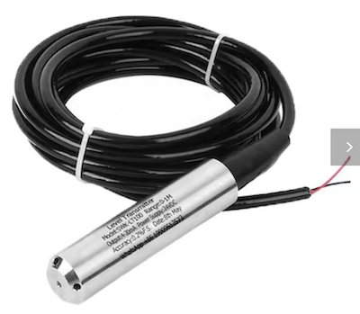
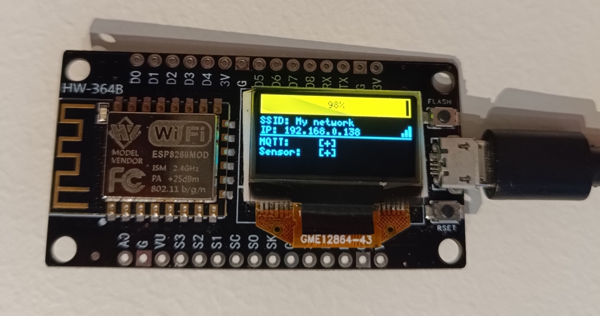
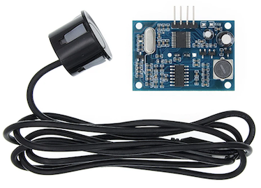
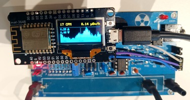
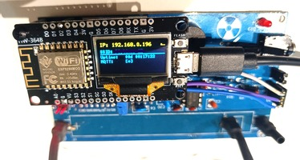
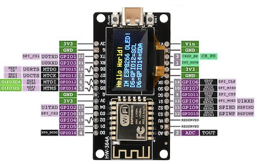
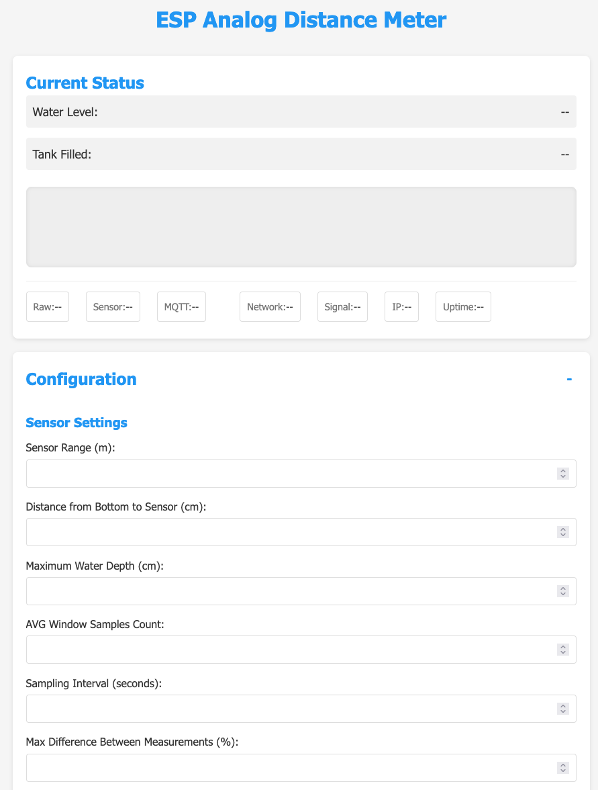
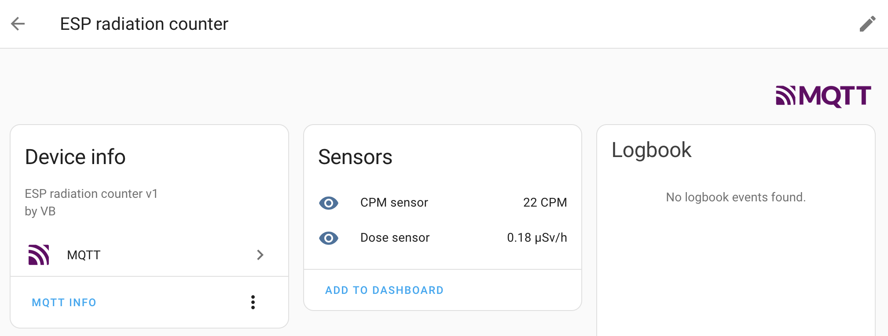

# ESP Unified

A unified ESP8266 firmware that combines three sensor projects into a single codebase with a runtime-selectable plugin system.

## Supported Plugins

### Analog Distance Meter (`analog_distance`)




Measures distance using a 4-20mA analog sensor (e.g. SWK-LT100) connected to the `A0` pin. Calculates relative fill percentage and absolute water depth. Publishes `relative`, `absolute`, and `measured` values to MQTT.

**Wiring:** Sensor output → 4-20mA to 0-3.3V converter → `A0`

The converter circuit uses a 160Ω precision resistor (V = I × R → 4mA = 0.64V, 20mA = 3.2V). Optionally add a 10nF capacitor for noise filtering and a 3.6V Zener diode for overvoltage protection.

```
4-20mA Sensor Loop
     |   |
    (-) (+) ----+---------+--------+-------> A0
     |          |         |        |
     |         160Ω     10nF    3.6V Zener
     |          |         |        |
    (-) (+) ----+---------+--------+-------> GND
```

### Ultrasonic Distance Meter (`ultrasonic_distance`)




Measures distance using an HC-SR04 / JSN-SR04T ultrasonic sensor. Calculates relative fill percentage and absolute depth. Publishes `relative`, `absolute`, and `measured` values to MQTT.

**Wiring:** `TRIG` → `D1`, `ECHO` → `D2`, 5V from `VU` pin, `GND` to any `G` pin.

### Radiation Counter Gateway (`radiation_counter`)




Bridges Geiger-Müller tube detectors (GGreg20_V3, RadiationD-v1.1 / CAJOE, etc.) to MQTT. Calculates CPM and dose rate (µSv/h). Two-page OLED display with graph and info, toggled by the `FLASH` button.

**Wiring:** Detector signal → `D2`. ESP8266 provides 3.3V (`3V` pin) or 5V (`VU` pin) to the detector board.

**Parameters:**
- `Tube Factor` — CPM to µSv/h conversion. ~123 for J305, ~175 for CBM-20.
- `Graph Bar Seconds` — seconds per graph bar on OLED. 665s ≈ 11min gives ~24h history.

## Required Components



- NodeMCU ESP8266 Development Board (recommend the variant with built-in 0.96" OLED)
- A sensor appropriate for the chosen plugin
- Optional: external 128x64 OLED display — `D5` as `SCL`, `D6` as `SDA`

## Setup

1. Flash firmware and LittleFS filesystem (see below).
2. On first boot, `WiFiManager` creates an AP named `ESP_<ChipID>`. Connect to it and configure your WiFi network. The device restarts automatically.
3. Navigate to the device's IP address (shown on the OLED and Serial) to open the admin dashboard.
4. Select the active plugin, configure sensor and MQTT parameters, then **Save & Restart**.



HomeAssistant autodiscovery is published automatically — the device should appear under the MQTT integration.



### MQTT Topics

The default state topic is `<device_name>/stat/<plugin_id>`. Payload examples:

**Distance meters:**
```json
{ "relative": 0.73, "absolute": 1.12, "measured": 1.51 }
```

**Radiation counter:**
```json
{ "cpm": 42, "dose": 0.34 }
```

## IDE Setup

For clangd-based code intelligence (autocompletion, error checking), run the setup script after cloning:

```bash
./setup-ide.sh
```

This generates `compile_commands.json` and `.clangd` with the correct toolchain paths for your machine. Restart the clangd language server afterwards. Re-run after changing `platformio.ini` dependencies.

## Testing

Native unit tests run on the host machine using GoogleTest. They cover calculators, logger, and plugin registry — no hardware required.

### Via Docker (recommended)

```bash
docker build -f Dockerfile.test -t esp-tests .
docker run --rm esp-tests
```

### Via PlatformIO CLI

Requires `g++` on PATH:

```bash
pio test -e native -v
```

### CI

Tests run automatically on every push/PR via GitHub Actions (see `.github/workflows/ci.yml`).

## Building & Flashing

Requires [PlatformIO](https://platformio.org/).

### Via USB

```bash
# Build
pio run -e nodemcu

# Flash firmware
pio run -t upload -e nodemcu

# Flash LittleFS filesystem (web UI)
pio run -t uploadfs -e nodemcu
```

### Via OTA (Over-The-Air)

Replace `<DEVICE_IP>` with the device's IP address:

```bash
# Flash firmware
pio run -t upload -e nodemcu_ota --upload-port <DEVICE_IP>

# Flash LittleFS filesystem
pio run -t uploadfs -e nodemcu_ota --upload-port <DEVICE_IP>
```
